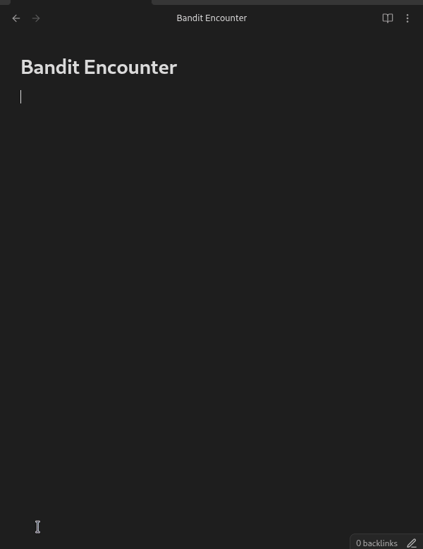
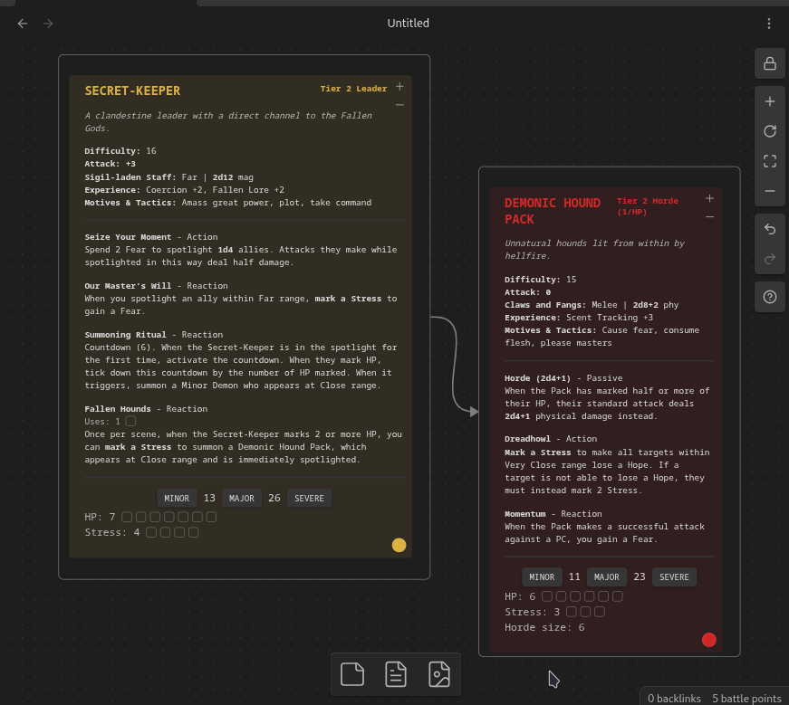

# BeastVault

An [obsidian.md](https://obsidian.md) plugin for Daggerheart TTRPG GMs to search, edit, and create beautiful adversary & environment stat blocks.

## Features

- Search and insert adversaries & environments from the SRD via commands
- Beautifully render editable stat blocks with intuitive UI
- Roll dice for attack or damage with one click
- Track marked HP, stress, countdowns and feature uses
- Battle points counted in the status bar
- Customizable colors to look pretty in any color theme
- Works in a canvas for [FCG](https://freshcutgrass.app)-style encounter building

### Planned

- [ ] Local library support for homebrew stat blocks to seach over
- [ ] "Summon" buttons for adversaries/environments that might summon others
- [ ] Ability to mark adversaries with conditions (e.g. Vulnerable, Restrained)

## Examples

Insert an adversary via a command by going "Ctrl+P > Insert adversary from library".

> [!tip] Keybind
> For quicker access, bind plugin commands to a key combination of your choice from the Hotkeys settings tab.
> I use `Alt+A` to insert an adversary & `Alt+E` to insert an environment.

Create your own homebrew adversary by creating a `daggerheart` code block or editing an inserted one.

> [!tip] Template
> You can insert an empty adversary template by using the "Insert adversary template" command.

Build out full encounters in a canvas and track their HP & stress during a session:

> [!tip] Canvas node auto-resizing
> Building encounters in a canvas is made much more convenient by enabling node auto-resizing in [this plugin](https://github.com/Developer-Mike/obsidian-advanced-canvas).
> During a playing session, using canvas in read-only mode is recommended.

## Reference

The `daggerheart` code block parses the adversary or an environment as [YAML](https://yaml.org) with the following properties:

| Property | Definition | Example |
| --- | --- | --- |
| `name` | Name of the adversary | `Bear` |
| `tier` | Adversary tier | `1` |
| `type` | Type of the adversary | `Bruiser` |
| `desc` | Adversary description | `A large bear with thick fur and powerful claws.` |
| `difficulty` | Adversary difficulty | `14` |
| `weapon` | Name of the adversary's weapon | `Claws` |
| `range` | Range of the adversary's weapon | `Close` |
| `damage` | Amount and type of adversary's weapon damage | `1d8+3 phy` |
| `hp` | Total adversary hitpoint slots | `6` |
| `stress` | Total adversary stress slots | `3` |
| `thresholds` | Adversary thresholds, separated by a `/`; leave blank for minions with 1 HP | `9/17` |
| `attack` | Adversary attack bonus; click to roll for attack | `+1` |
| `xp` | Adversary experiences | `Ambusher +2, Keen Senses +3` |
| `motives` | Adversary's motives and tactics | `Climb, defend territory, pummel, track` |
| `features` | List of feature objects, see table below | |
| `id` | Stat block id, used by the plugin to track marked HP, stress etc; inserted automatically, can be any random string; defaults to `fileName::adversaryName` | `a2sd4vsf` |

`feature` properties:

| Property | Definition | Example |
| --- | --- | --- |
| `name` | Name of the feature | `Relentless (2)` |
| `type` | Feature type | `Passive` |
| `desc` | Feature description; supports markdown | `Make a standard attack. On a success, the target is *Vulnerable* until they next act.` |
| `uses` | Uses per scene (for those features that limit them) | `2` |
| `countdown` | Size of the countdown activated by the feature, if any | `6` |
| `flavor` | Hints for GM/PCs when using an adversary or environment in their setting | `Have any of the PCs forded rivers like this before? Are any of them afraid of drowning?` |

For environments, additional properties are available:

| Property | Definition | Example |
| --- | --- | --- |
| `tone` | Tone and feel of the environment | `Musty and mournful, serene yet slightly wrong` |
| `impulses` | Environment impulses | `Bar crossing, carry away the unready, divide the land` |
| `adversaries` | Potential adversaries in an environment | `Guards (Bladed Guard, Head Guard), Masked Thief, Merchant` |

All of the properties are optional, and simply won't render if skipped.

## Attributions

Plugin inspired by [FreshCutGrass](https://freshcutgrass.app) and [DaggerForge](https://github.com/Torutu/daggerforge).

### Copyright Notice

This plugin includes materials from the Daggerheart System Reference Document 1.0, © Critical Role, LLC. All rights reserved.

Public Game Content created and owned by Darrington Press, LLC. Available at https://www.daggerheart.com.

Licensed under the Darrington Press Community Gaming License: https://darringtonpress.com/license/.

Stat blocks may have minor edits to correct obvious errors.

